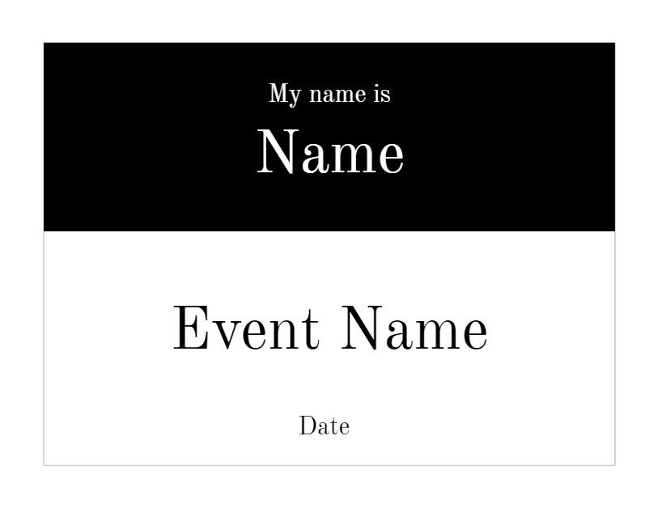
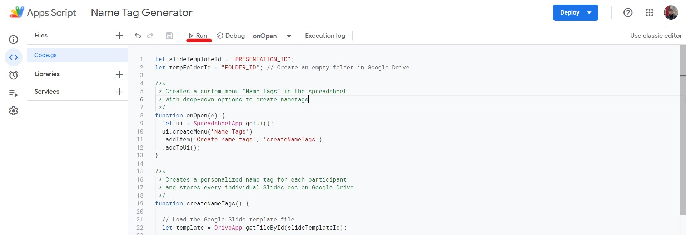

# Name Tag Generator

## Description

Writing manually tens or hundred of name tags 📝 can be a bummer. This script automates the process and handles the creation of hundreds of name tags in a couple of seconds ⏲️ with its only requirement being the ownership of a Google account.

## Requirements

* Google Account 🙂
* Internet Connection 🌐

Also, in order to be able to follow through this sample tutorial you are going to need to use your "default" Google account.

What is meant by "default" is that the account you want to use is the first account you logged in your browser. This can be verified by clicking your google account avatar on the upper right corner of [Google](https://google.com) ...

... or by taking a glimpse of your url when logged into your account in any of Google's products.

The `0` in `mail/u/0` specifies the **default user**.

If you don't want to use your current default account for this there are 2 ways to fix the issue:

1. **The long way:** Log off all your accounts and first log in with your preferred one
2. **Simpler way:** If your browser has this feature (most have it by now) you can create another browser profile with your preferred account. More about that [here](https://support.google.com/a/users/answer/9310144?hl=en).

## Usage

1. Create your name tag design in any design program you want. For the sake of this guide I am going to use a Google Slides' template, altered a bit to suit the needs. You can use this [template](https://docs.google.com/presentation/d/1Ra4UJXOA1lvJjtGkK7s6aJxUBWFshJUR1paMMHCT-II/template/preview).
   * If you have used Google Slides you're good to go.
   * If you have used any other program you leave out only the dynamic details which can be the `name` or perhaps the `title` and export the *template* as a JPEG or PNG. Then create a new Google Slides presentation and add the photo to the first slide. Feel free to make any modifications you need regarding the styling and then add as many text boxes as the dynamic content that differs through the participants. Add placeholder text in each of the aforementioned text boxes and change the font size and styling to match your design.

    

2. Copy down this presentation's ID. You can find the ID at the URL. The format is: `https://docs.google.com/presentation/d/PRESENTATION_ID/edit`

3. Create an empty folder anywhere in your Google Drive and copy the folder's ID. This folder will be the output of all the slides. Likewise, the format of the folder's ID is: `https://drive.google.com/drive/folders/FOLDER_ID`. You will need this ID at step 5.

4. Copy [this spreadsheet](https://docs.google.com/spreadsheets/d/10P5e9jLny8iQ2U2UPm9-tMDVnql2Ssnut4Xm3BFK0pg/template/preview). Click `Extensions` -> `Apps Script` and this will redirect you to the Google's Script platform. If you are not able to get there it's probably because you haven't used your default account. See how to fix this [here](#requirements).

5. Change the `Presentation_ID` and `FOLDER_ID` in the first two lines of the script with the ones you acquired from steps 2 and 3.

6. Save and click **Run**

    

7. An alert will pop up requiring your authorization of the script. There is nothing malicious here going on, it's just that your script is not certified therefore not trusted by Google. Click `Review Permissions`.

8. On the pop up window click on your account and authorize the script. Click `advanced` and then below `Go to [Name Tag Generator] (unsafe)` :warning:.

    

9. You are good to go. Now if you go back to your spreadsheet there will be a `Name Tags` menu in the end. Click at `Create name tags` and go take a look at the folder you specified beforehand. The name tags are already there 🧙.

10. You can go check that the output is correct and if everything is fine, now click the `Convert to PDF` option of the menu. All slides will be converted to PDF :smile:.

## Common Issues

* **If the template has an identifier word more than once it is going to replace all occurances of that word.** Be cautious on that. However, the solution is simple, you'll just have to remove the common word from the textbox that misbehaves. ✔️
* At this point, the script is not modular and this could be a problem for people who are not familiar with JavaScript. If you need to add more dynamic fields to your name tags, consult whoever with little or more JavaScript knowledge. I am sure they will be able to modify the script to your needs in a couple of minutes. 💻
